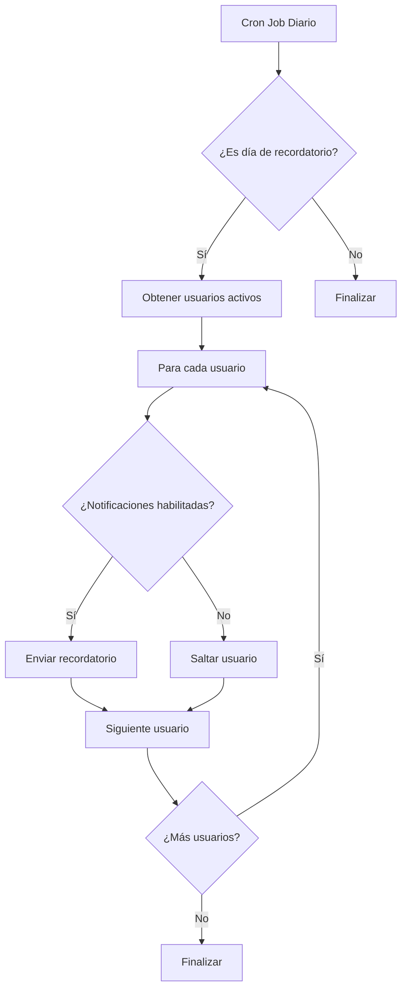
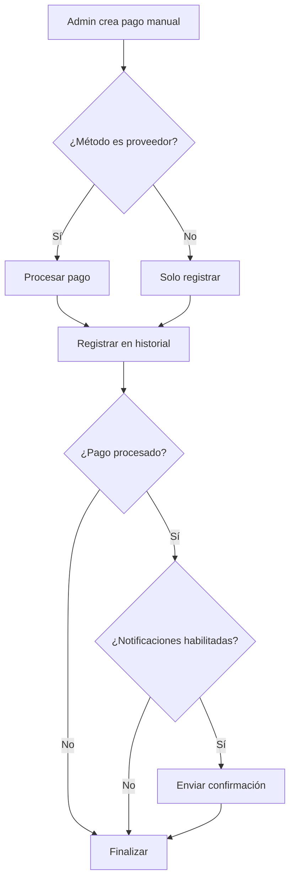

# Sistema de Recordatorios de Pago

## Descripción General

El sistema de recordatorios de pago envía notificaciones por correo electrónico a los usuarios antes de que se procesen sus pagos programados. Los recordatorios se envían según la configuración definida en `payment_schedule_settings`.

## Características

### 1. **Notificaciones de Recordatorio**
- Se envían automáticamente según los días configurados antes del pago
- Respetan las preferencias de notificación del usuario (`order_notifications`)
- Incluyen información del monto, fecha de vencimiento y días restantes
- Soporte multiidioma (inglés y español)

### 2. **Notificaciones de Confirmación de Pago**
- Se envían cuando se procesa un pago manual desde el admin
- Incluyen detalles del pago: monto, método, fecha, ID de transacción
- También respetan las preferencias del usuario

## Configuración

### Variables de Entorno

Agrega las siguientes variables a tu archivo `.env`:

```bash
# Cron Job Security
CRON_SECRET=your-secret-key-here

# Email Configuration (ya existentes)
RESEND_API_KEY=your-resend-api-key
CONTACT_FROM_EMAIL=noreply@purvita.com
CONTACT_FROM_NAME=PūrVita
CONTACT_REPLY_TO_EMAIL=support@purvita.com
```

### Configuración de Recordatorios

Los recordatorios se configuran desde la página de administración:

**Ruta:** `/admin/payments/history`

**Campos:**
- **Frecuencia:** Mensual, Semanal, Quincenal
- **Día de cobro:** Día del mes (1-28) o día de la semana
- **Recordatorios:** Días antes del cobro (ej: `3,1` = 3 días antes y 1 día antes)

**Ejemplo:**
```
Frecuencia: Mensual
Día del mes: 10
Recordatorios: 3, 1
```

Esto enviará recordatorios:
- **Día 7** del mes (3 días antes del cobro)
- **Día 9** del mes (1 día antes del cobro)

## Cron Job

### Vercel Cron

El sistema usa Vercel Cron para ejecutar el job diariamente:

**Archivo:** `vercel.json`
```json
{
  "crons": [
    {
      "path": "/api/cron/payment-reminders",
      "schedule": "0 9 * * *"
    }
  ]
}
```

**Horario:** Todos los días a las 9:00 AM UTC

### Endpoint del Cron

**Ruta:** `GET /api/cron/payment-reminders`

**Autenticación:** Bearer token usando `CRON_SECRET`

**Respuesta exitosa:**
```json
{
  "message": "Payment reminders sent",
  "sent": 150,
  "total": 150,
  "daysUntilPayment": 3,
  "nextPaymentDate": "2025-11-10T00:00:00.000Z"
}
```

### Ejecución Manual

Para probar el cron job manualmente:

```bash
curl -X GET https://your-domain.com/api/cron/payment-reminders \
  -H "Authorization: Bearer your-cron-secret"
```

## Preferencias de Usuario

Los usuarios pueden controlar si reciben notificaciones de pago desde:

**Ruta:** `/settings/notifications` o `/affiliate/[code]/settings/notifications`

**Campo:** "Order Notifications"
- ✅ **Habilitado:** Recibe recordatorios y confirmaciones de pago
- ❌ **Deshabilitado:** No recibe ninguna notificación de pago

## Flujo de Notificaciones

### Recordatorios Automáticos



### Confirmación de Pago Manual



## Archivos Principales

### Servicio de Notificaciones
**Archivo:** `src/modules/payments/services/payment-notification-service.ts`

**Métodos:**
- `sendPaymentReminder()` - Envía recordatorio de pago próximo
- `sendPaymentConfirmation()` - Envía confirmación de pago procesado
- `hasOrderNotificationsEnabled()` - Verifica preferencias del usuario

### Endpoint de Cron
**Archivo:** `src/app/api/cron/payment-reminders/route.ts`

**Funciones:**
- `GET()` - Handler principal del cron job
- `calculateNextPaymentDate()` - Calcula próxima fecha de pago

### Integración con Pagos Manuales
**Archivo:** `src/app/api/admin/payments/history/route.ts`

Envía confirmación automáticamente cuando se procesa un pago manual.

## Base de Datos

### Tabla: `notification_preferences`

```sql
CREATE TABLE notification_preferences (
  user_id uuid PRIMARY KEY,
  promotional_offers boolean DEFAULT true,
  team_updates boolean DEFAULT true,
  new_video_content boolean DEFAULT false,
  order_notifications boolean DEFAULT true,  -- ← Controla notificaciones de pago
  created_at timestamptz DEFAULT now(),
  updated_at timestamptz DEFAULT now()
);
```

### Tabla: `payment_schedule_settings`

```sql
CREATE TABLE payment_schedule_settings (
  id boolean PRIMARY KEY DEFAULT true,
  frequency text NOT NULL,
  day_of_month integer,
  weekday integer,
  reminder_days_before integer[] DEFAULT '{3,1}',  -- ← Días de recordatorio
  default_amount_cents integer NOT NULL,
  currency text NOT NULL,
  payment_mode text NOT NULL,
  updated_at timestamptz DEFAULT now()
);
```

## Plantillas de Email

### Recordatorio de Pago

**Asunto (EN):** `Reminder: Upcoming Payment - X days`
**Asunto (ES):** `Recordatorio: Pago próximo - X días`

**Contenido:**
- Saludo personalizado
- Monto del pago
- Fecha de vencimiento
- Días restantes
- Instrucciones para asegurar fondos

### Confirmación de Pago

**Asunto (EN):** `✅ Payment Confirmed - $XX.XX USD`
**Asunto (ES):** `✅ Pago Confirmado - $XX.XX USD`

**Contenido:**
- Agradecimiento
- Monto pagado
- Método de pago
- Fecha y hora
- ID de transacción (si aplica)
- Confirmación de actualización de cuenta

## Monitoreo y Logs

### Logs del Cron Job

```
[Payment Reminders] Sent 150 reminders for payment due on 2025-11-10 (3 days)
```

### Logs de Notificaciones

```
Payment reminder sent to user@example.com for 34.99 USD due on November 10, 2025
Payment confirmation sent to user@example.com for 34.99 USD
Payment reminder skipped for user@example.com - notifications disabled
```

## Solución de Problemas

### Los recordatorios no se envían

1. **Verificar configuración de Vercel Cron:**
   - Ir a Vercel Dashboard → Project → Settings → Cron Jobs
   - Verificar que el cron esté activo

2. **Verificar `CRON_SECRET`:**
   - Asegurarse de que esté configurado en las variables de entorno

3. **Verificar configuración de recordatorios:**
   - Ir a `/admin/payments/history`
   - Verificar que `reminder_days_before` tenga valores

4. **Revisar logs:**
   - Vercel Dashboard → Deployments → Functions → Logs

### Los usuarios no reciben correos

1. **Verificar preferencias del usuario:**
   - Ir a `/settings/notifications`
   - Verificar que "Order Notifications" esté habilitado

2. **Verificar configuración de email:**
   - Verificar `RESEND_API_KEY` en variables de entorno
   - Verificar `CONTACT_FROM_EMAIL` esté configurado

3. **Revisar logs de email:**
   - Buscar errores en los logs del servidor

## Próximas Mejoras

- [ ] Soporte para múltiples idiomas basado en preferencias del usuario
- [ ] Tracking de recordatorios enviados para evitar duplicados
- [ ] Dashboard de métricas de notificaciones
- [ ] Personalización de plantillas de email por administrador
- [ ] Recordatorios para pagos atrasados
- [ ] Notificaciones push además de email

